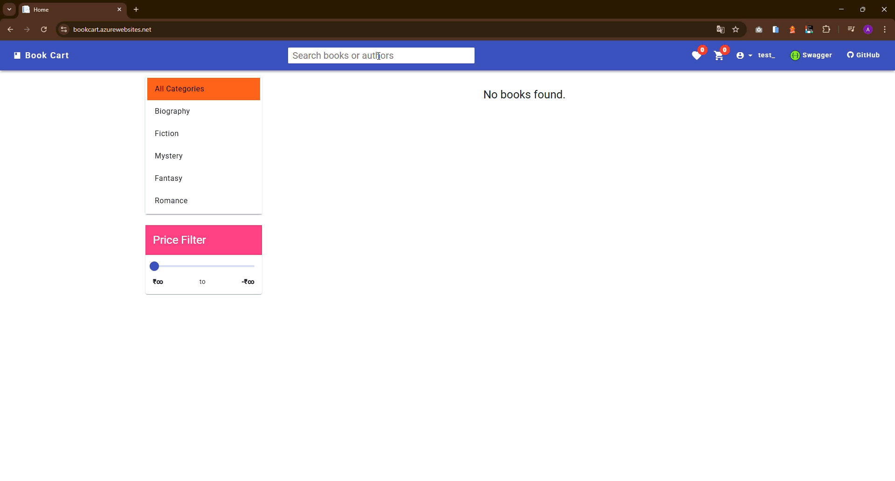
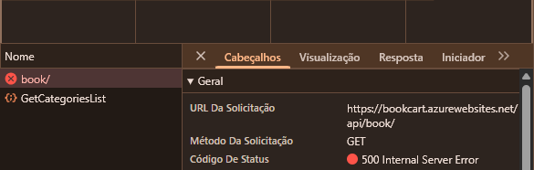
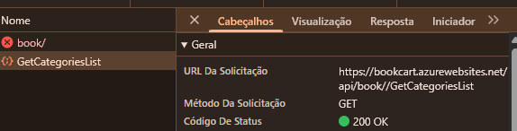
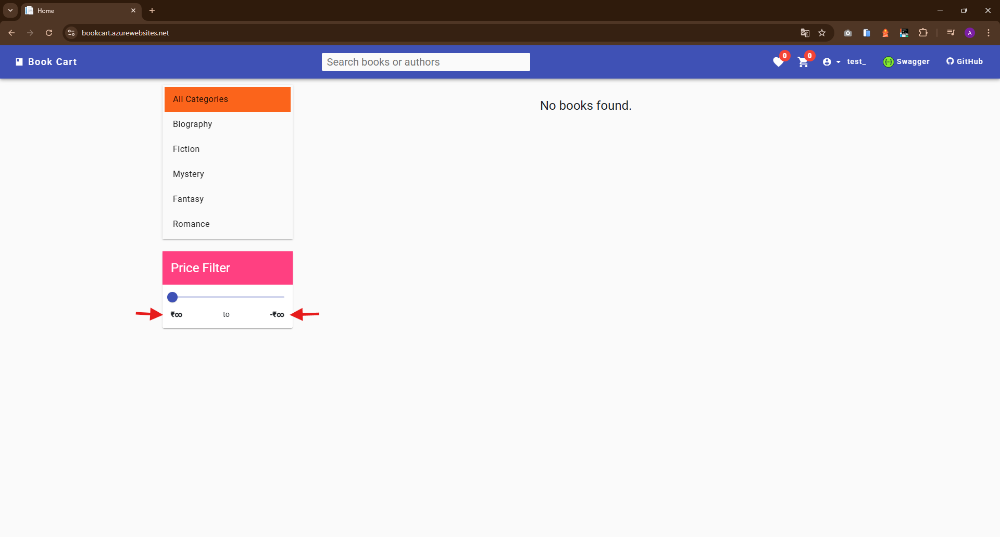

### [BUG-001] Inconsistência de Status HTTP e Falha na Busca Global

- Status na Planilha: ID 1 (NOK).

- Título: [Busca] Erro Interno do Servidor (503) ao realizar buscas em "All Categories".

- Severidade: Crítica (Inviabiliza a principal função do site).

- Ambiente: Web - Book Cart.

Passos para Reproduzir:

1. Acessar a home do Book Cart.

2. Com a categoria "All Categories" selecionada, realizar qualquer busca.

3. Observar a mensagem na tela e o console do desenvolvedor (F12).

**Resultado Esperado:** O sistema deve processar a busca e retornar status 200 OK no corpo da resposta.

**Resultado Atual:** O frontend exibe "No books found" com status 200, mas o DevTools revela um 500 Internal Server Error no processamento da requisição.

**Evidência:**

 
📸 Clique para ver a captura de tela

 

 

 

---

### [BUG-002] Falha na Persistência da Categoria Selecionada após Busca

- Status na Planilha: ID 2 (NOK).

- Título: [Filtros] Reset automático da categoria selecionada para o estado padrão "All Categories" após execução de busca.

- Severidade: Média (Prejudica a experiência de navegação e o refinamento de resultados).

- Ambiente: Web - Book Cart.

Passos para Reproduzir:

1. Acessar a página inicial do Book Cart.

2. Selecionar uma categoria específica no menu lateral (ex: "Biography").

3. Realizar uma pesquisa utilizando a barra de busca.

4. Observar o estado do filtro de categorias no menu lateral.

**Resultado Esperado:** O sistema deve manter a categoria previamente selecionada ("Biography") para filtrar os resultados da busca.

**Resultado Atual:** O filtro é resetado automaticamente para a primeira opção da lista ("All Categories"), perdendo o critério de seleção do usuário.

**Evidência:**

 
📸 Clique para ver o gif

 

---

### [BUG-003] Slider de Preço Funcionalmente Travado

- Status na Planilha: ID 3 (NOK).

- Título: [Filtros] Componente de Slider de Preço inoperante e com erro de renderização nos rótulos de limite.

- Severidade: Alta (Inviabiliza o uso de uma funcionalidade principal de filtragem).

- Ambiente: Web - Book Cart.

Passos para Reproduzir:

1. Localizar o componente "Price Filter" na barra lateral.

2. Tentar interagir com os seletores (slider) para alterar o valor mínimo ou máximo.

**Resultado Esperado:** O slider deve permitir o arraste suave para seleção de valores.

**Resultado Atual:** O componente está travado no valor visual "100"

Evidência:

 
📸 Clique para ver o gif

 

---

### [BUG-005] Texto Ilegível nos Rótulos do Filtro de Preço

- Status na Planilha: ID 5 (NOK).

- Título: [Filtro] Rótulos de limite de preço (min/max) apresentam caracteres ilegíveis.

- Severidade: Média (Dificulta a visualização limpa e a compreensão dos valores reais para o usuário final).

- Ambiente: Web - Book Cart.

Passos para Reproduzir:

1. Acessar a página de produtos onde o filtro de preço está disponível.

2. Localizar o componente "Price Filter" na barra lateral.

3. Observar os textos exibidos abaixo do slider de preço.

**Resultado Esperado:** O sistema deve exibir valores numéricos claros e que correspondam à moeda e aos limites de preço dos produtos.

**Resultado Atual:** Os rótulos exibem símbolos ilegíveis (semelhantes ao símbolo de infinito "∞"), impedindo uma visualização limpa e a identificação correta da faixa de preço.

**Evidência:**

 
📸 Clique para ver a captura de tela do erro de legibilidade

 

